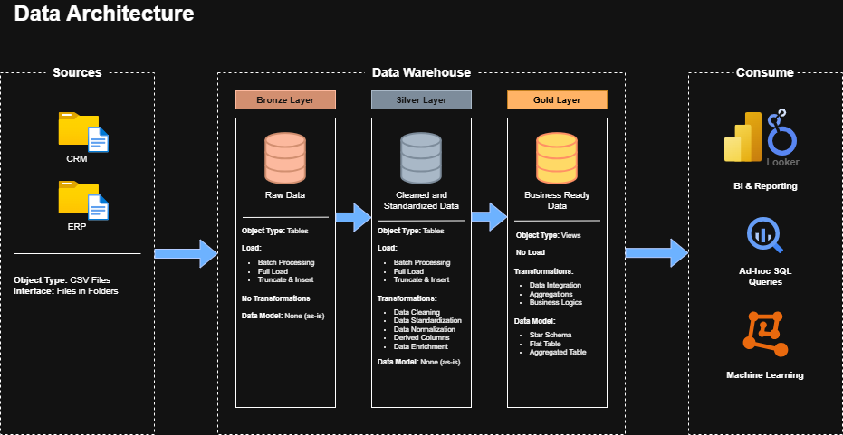

# SQL Data Warehouse (Data Engineering) Project

Implementation of a modern Data Warehouse using **SQL Server**. Features a 3-layer Medallion Architecture (Bronze → Silver → Gold) to integrate CRM and ERP data for Business Intelligence reporting.

> Project based on the tutorial by [Data With Baara](https://youtu.be/9GVqKuTVANE?si=sPSXWtp9neqQETvb) — all credit to the original author.

---

##  📐 Data Architecture

This project impelemnts the **Medallion Architecture** with three progressive layers:


|Layer|Description|
|-----|-----------|
| 🥉**Bronze** | Raw data ingested as-is from source CSV files (CRM & ERP). No transformations applied. |
| 🥈**Silver** | Cleaned, standardized, and normalized data. Handles deduplication, type casting, null handling, and column normalization. |
| 🥇**Gold** | Business-ready data modeled into a **Star Schema** — dimension and fact tables optimized for analytics and BI reporting. |

---

##  📖 Project Overview

| Component | Description |
|-----------|-------------|
| **Data Architecture** | Medallion Architecture with Bronze, Silver, Gold layers |
| **ETL Pipelines** | Stored procedures to extract, transform, and load data across layers |
| **Data Modeling** | Star schema with fact and dimension tables |

---

##  🛠️ Tech Stack

| Tool | Purpose |
|------|---------|
| **SQL Server Express** | Database engine |
| **SSMS** | Query execution & database management |
| **T-SQL** | ETL scripts, stored procedures, DDL |
| **Draw.io** | Architecture & data model diagrams |
| **Git / GitHub** | Version control |

---

## 🗄️ Data Sources
 
Two source systems are integrated in this project:
 
| Source | Description | Format |
|--------|-------------|--------|
| **CRM** | Customer profiles, sales orders, product info | CSV |
| **ERP** | Customer demographics, product categories, location data | CSV |
 
---

##  📂 Repository Structure
```
end-to-end-data-engineering-sql/
│
├── datasets/                    # Source CSV files
│   ├── source_crm/                     # CRM system data
│   └── source_erp/                     # ERP system data
│
├── docs/                        # Documentation & diagrams
│   ├── data-architecture.png    # Architecture overview diagram
│   ├── data-catalog.md          # Gold layer data catalog
│   ├── data-flow.png            # ETL data flow diagram
│   ├── data-model.png           # Star schema diagram
│   └── integration-model.png    # How tables are related
│
├── scripts/                          # All SQL scripts
│   ├── init_database.sql             # Database & schema initialization
│   ├── bronze/
│   │   ├── ddl_bronze.sql            # Table creation for bronze layer
│   │   └── procedure_load_bronze.sql # Stored procedure: load raw data
│   ├── silver/
│   │   ├── ddl_silver.sql            # Table creation for silver layer
│   │   └── procedure_load_silver.sql # Stored procedure: clean & transform
│   └── gold/
│       └── ddl_gold.sql         # Views for gold layer (star schema)
│
├── tests/                       # Data quality validation scripts
│   ├── quality_checks_silver.sql
│   └── quality_checks_gold.sql
│
├── LICENSE
└── README.md
```

## 🚀 What's Next
 
The Gold layer of this warehouse serves as the data source for a follow-up analytics project:
 
**[📊 SQL Data Analytics & BI Dashboard →](https://github.com/faridd35/sql-data-analytics-dashboard-project)**
Exploratory analysis, customer segmentation, product performance, and an interactive Power BI dashboard — all built directly on top of the Gold layer views from this warehouse.
```

## 🙏 Credits
 
This project follows the tutorial **"SQL Data Warehouse Project from Scratch"** by [Data With Baraa](https://www.youtube.com/@datawithbaraa).  
Original repository: [DataWithBaraa/sql-data-warehouse-project](https://github.com/DataWithBaraa/sql-data-warehouse-project)
 
---
